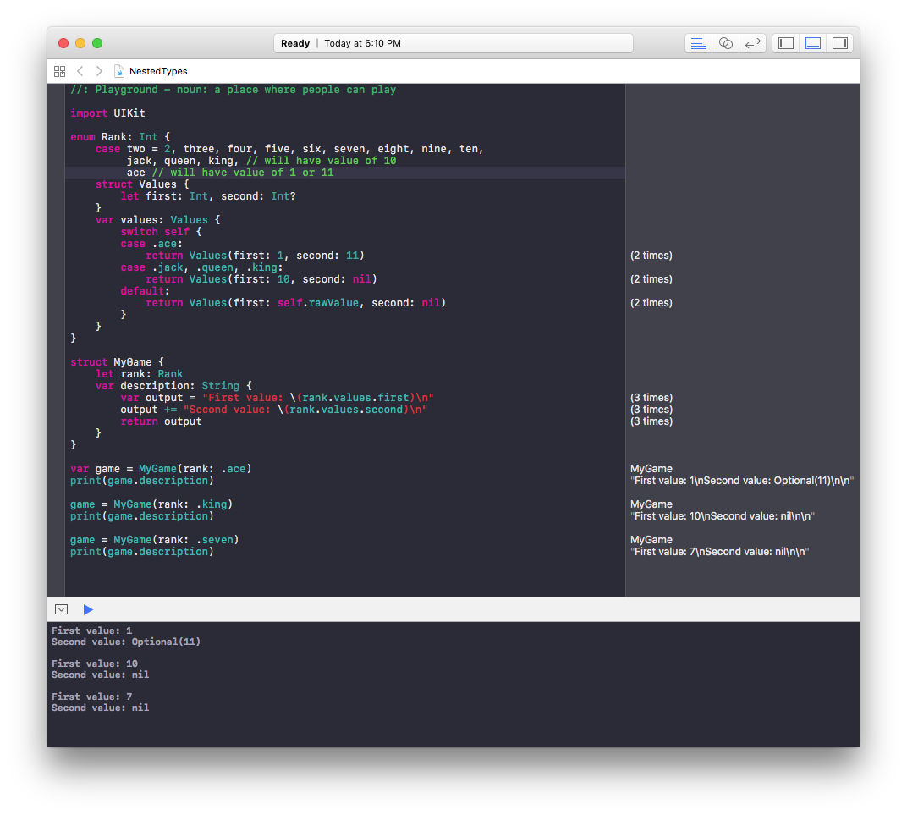

# [Nested Types](https://developer.apple.com/library/content/documentation/Swift/Conceptual/Swift_Programming_Language/NestedTypes.html)

`enum` with nested `var` that returns a tuple `struct`:

[Click for full size](https://raw.githubusercontent.com/dlcmh/swift-playground/nested-types/1.png)
 

